 
## Why we use computer?

> the stability that comes from using decision criteria is the primary reason we build digital(discrete) computers

## Digital in an Analog World

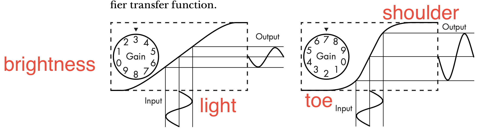

Above image is transfer function pull and ball. the transfer function produces different values of recorded birghness for differnt values of light. If too much of the light hits the shoulder of the curve, then the image will be overexposed, since the recorded bifhtness values will be closer together than in the actual scene. The goal is to adjust your exposure to hit the linear region, which will yeild the most failthful representation of reality. 
The volume control adjusts the gain, or steepness of the curve. As you can see, the higher the gain, the steeper the curve and the louder the output. A small change in the input causes a jump in the output at the steep part of the curve. It's like jumping from one finger to another after decision criterion, called a **threshold**. This partitions the continuous space into discrete regions, which is what we want for stability and noise immunity. 
With binary-coded decimal represenatation, you could represent bigger number with limited number of representation like your finger. You could represent more than 1000 with bits. Another reason why bits are better than digits for hardware is that with digits, there's no simple way to tweak a transfer function to get 10 distinct thresholds. Of course, if we could build 10 thresholds tn the same space as one, we'd do that. But as we've seen, we'd be better off with 10 bits instead of one digit.

## A Short Primer on Electricity

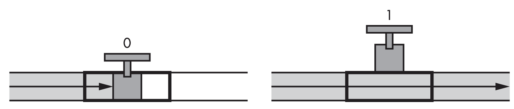

Above figure is for understanding electicity's 0 and 1 compare to plumber. Just as it takes time for electricity to make its way across a computer chip, it takes time for water to flow or propagate through a pip. This effect is __propagation delay__. Electricity travels through a wire like water travels through a pipe. It's a flow of elctrons.
- the metal inside : conductor
- the covering on the outside : insulator
- valves : switch
- The electrical equivalent of water pressure : voltage
- The amount of flow : current
- Resistance is measured in __ohms__

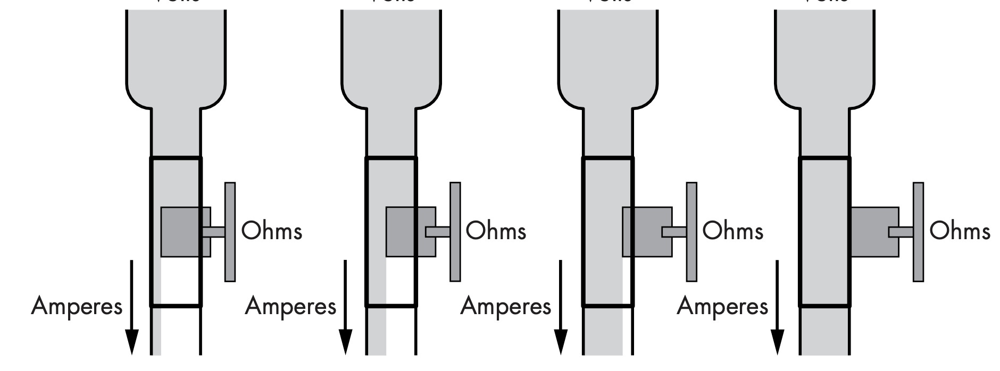

## Logic Gates

It's not efficient to build AND and OR gates using the _transistor_-_trsnsistor_-_logic_(_TTL_) technology of the 5400 and 7400 series parts, because the output from a simple gate circuit is naturally inverted, so it takes an inverter to make it come out right side up. This would make them more expensive, slower, and more power-hungry. So, the basic gates were NAND and NOR. 

## Improving Noise Immunity with Hysteresis
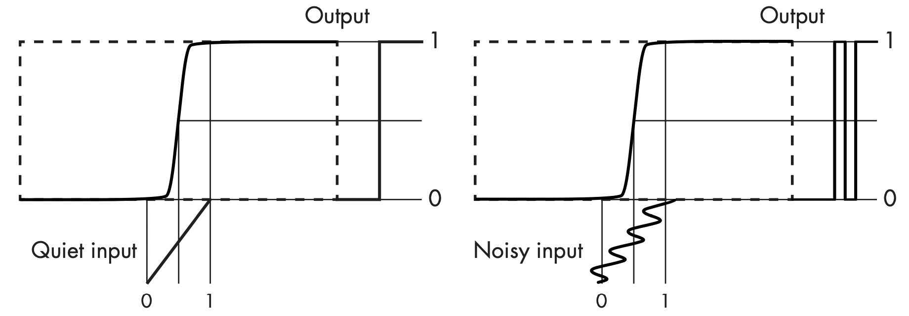

You can see that the noisy signal causes a _glitch_ in the output because the noise makes the sitnal cross the threshold more than once. We cab get arount this with _hysteresis_. The transfer function is not symmetrical; in effect, there are different transfer functions for rising signal (thos going from 0 to 1) and falling signals (thos going from 1 to 0) as indicated by the arrows. This gives us two different thresholds : one for rising signals and one for falling signals. This means that when a signal crosses one of the thresholds, it has a lot farther to go before crossing the other, and that translates into higher noise immunity. 

## Differential signaling
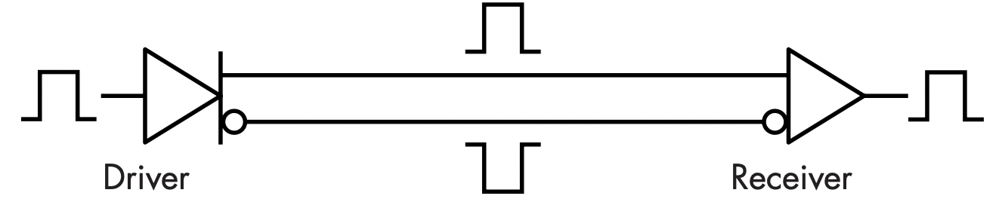

Differential signalling is a method for electrically transmitting information using two complementary signals. You can see that there's a _driver_ that converts the input signal into _complementary outputs_, and a _receiver_ that converts complementary inputs back into a _single-ended_ output. 

## Propagation Delay
_Propagation Delay_ is the amount of time it takes for a change in input to be reflected in the output.

## Building More Complicated Circuits
### Building Adder

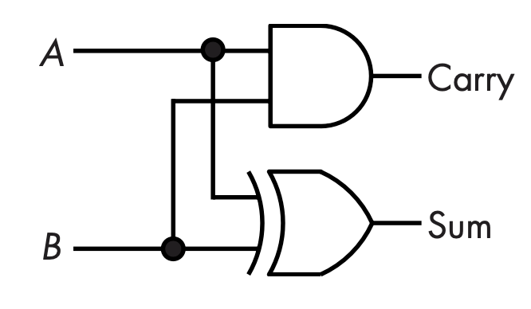

You can see that the XOR gate provides the sum and the AND gate provides the carry. Above figure is called a _half adder_ because something is missing. It's fine for adding two bits, but there needs to be a third input so that we can carry. This means that two adders are needed to get the sum for each bit. We carry when at least two of the inputs are 1. Below figure is called _full adder_.

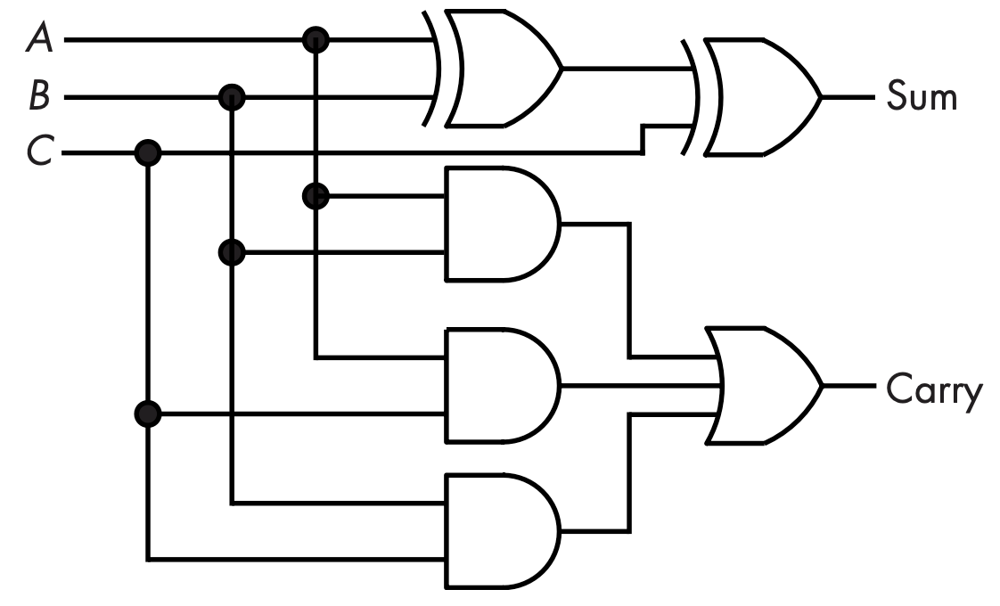

As you can see, this takes many more gates. But now that we have the full adder, we can use it to build an adder for more than one bit. Below figure shows a configuration called a _ripple-carry_ adder.

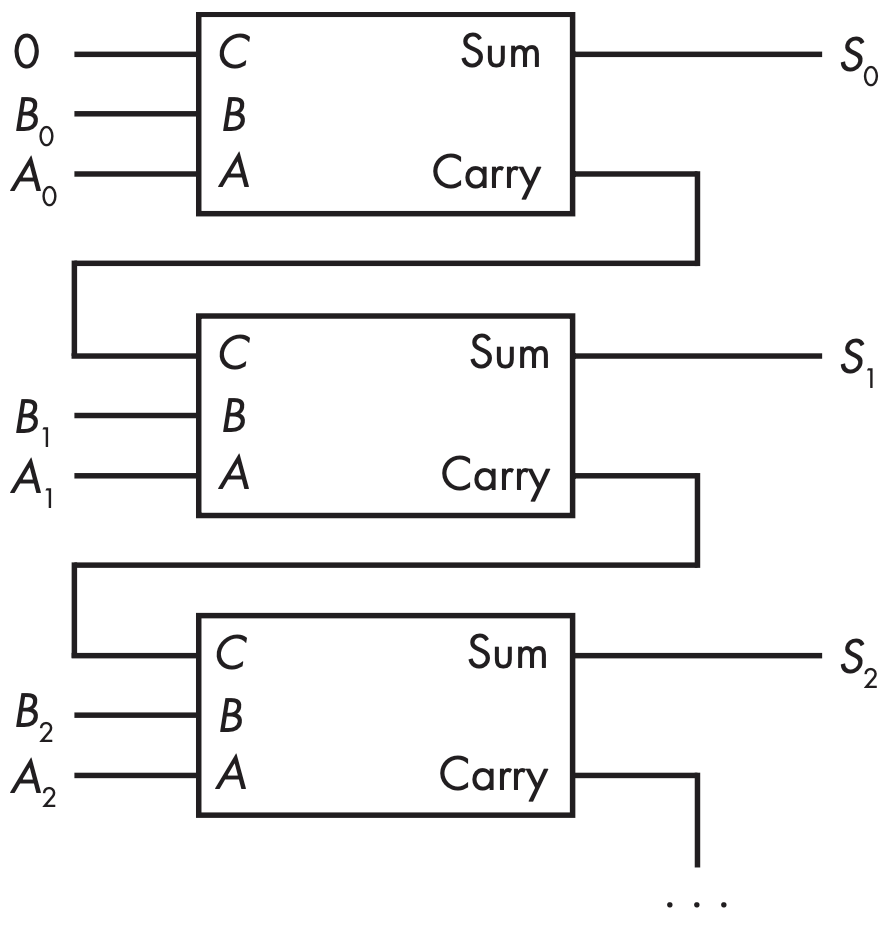

This _ripple-carry adder_ gets its name from the way that the carry ripples from one bit to the next. The big sticking point here is that we need C_i in order to get C_i+1, which causes the ripple. 

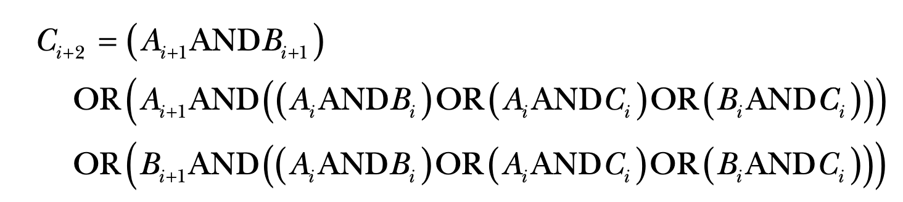

Note that although there are a lot more ANDs and ORs, there's still only two gates' worth of propagation delay. C_n always be generated from C_n-1, which uses an increasingly large number of gates as n increases. Although gates are cheap, they do comsume power, so there is a trade-off between speed and power consumption.

### Building Decoders
3:8 decoders that converts an octal value back into a set of single bits. When the input is 000, the Y_0 input is ture; when the input is 001, Y_1 is true; and so on. Decoders are principally named by the number of inputs and outputs.

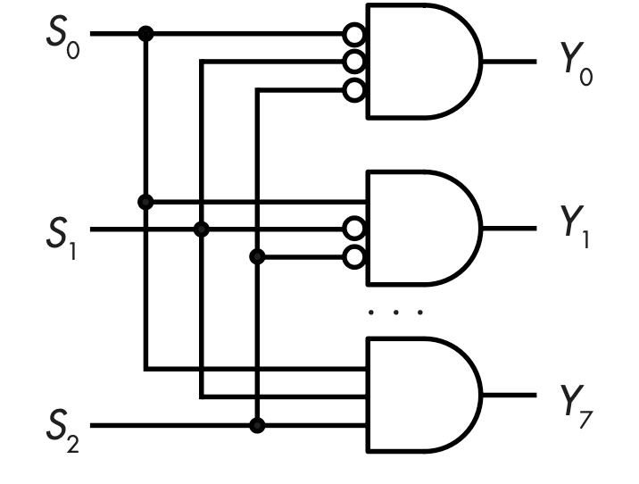
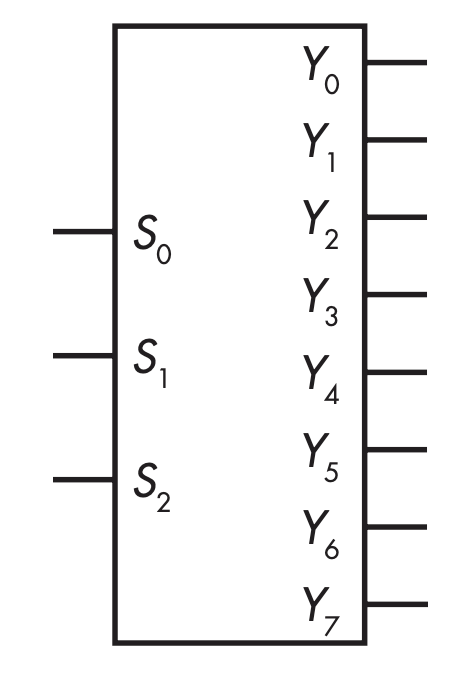

This decoder would commonly be drawn as shown in above figure.

### Building Multiplexers
You can use a decoder to build a _demultiplexer_, commonly abbreviated as _dmux_, which allows an input to be directed to one of several outputs. A demultiplexer combines a decoder with come additional gates, as shown in below figure. The demultiplexer directs the input signal _D_ to one of the four outputs Y_(0-3) based on the decoder inputs S_(0-1). 

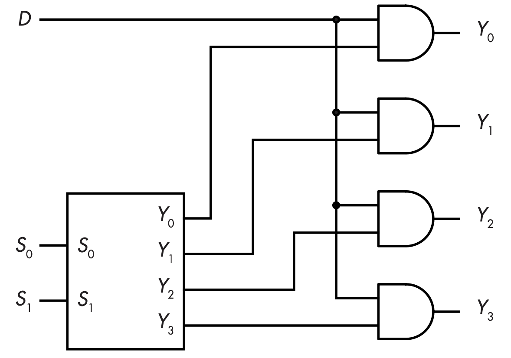
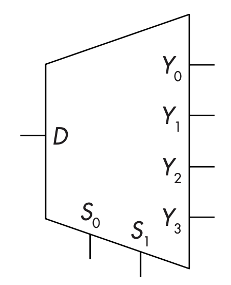

### Building Selector
Choosing one input from a number of inputs is another commonly performed function. Using gates, we cancreate another functional block called a _selector_ or _multiplexer_. Selector are also used a lot and have their own schematic symbol. 

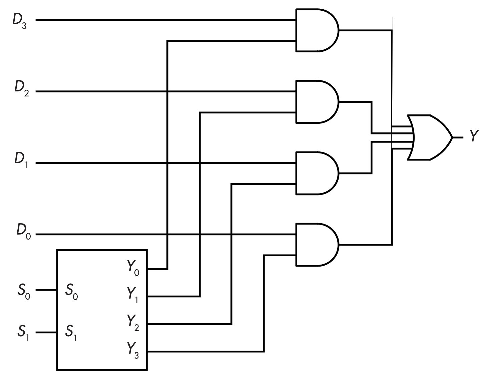
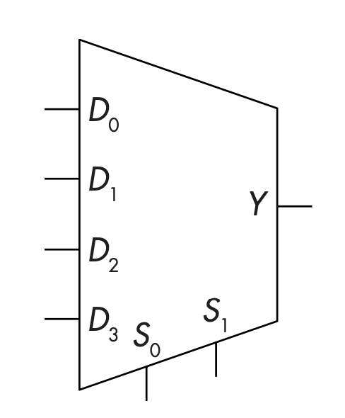

