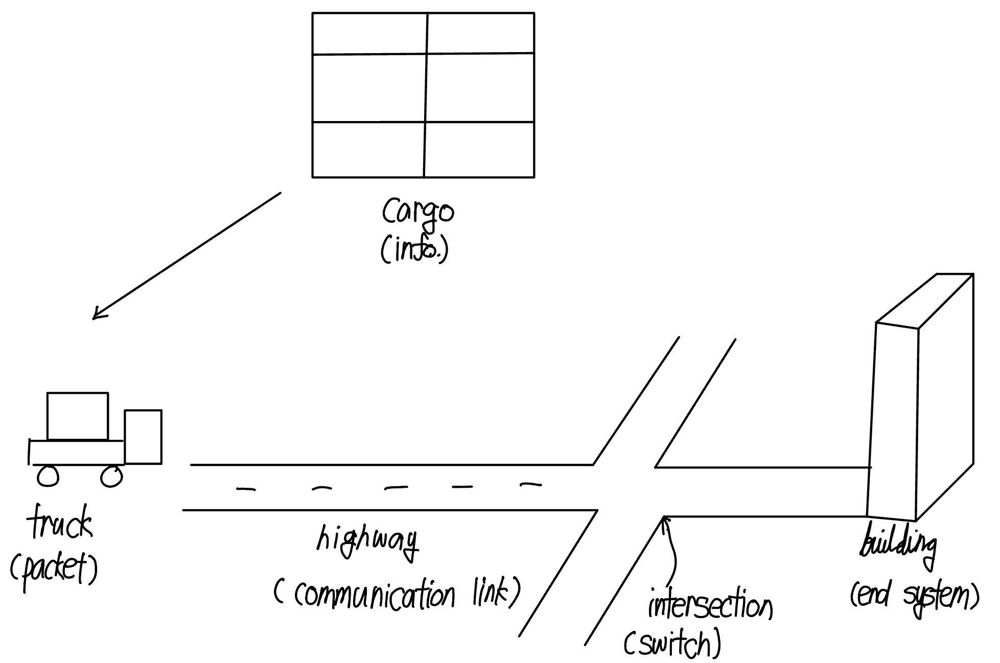
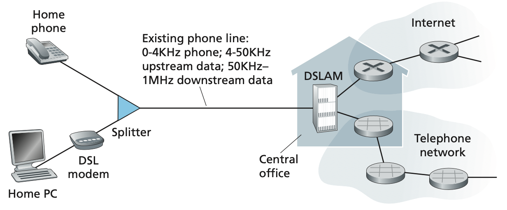
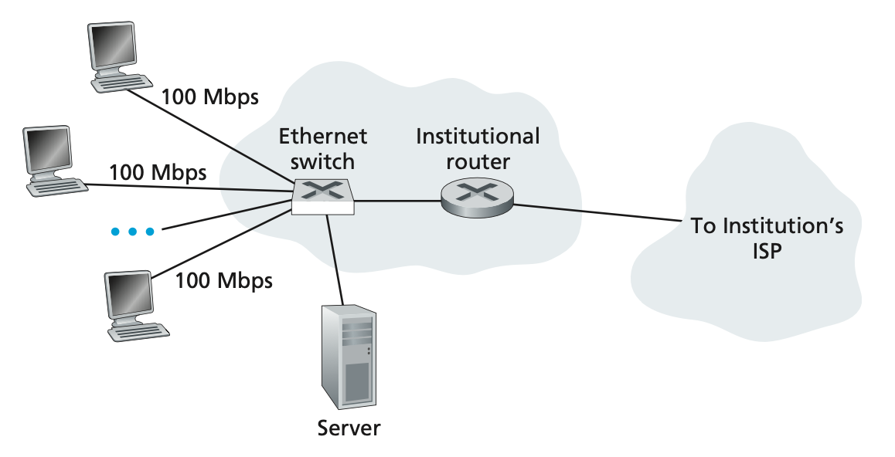

## 1. What is the Internet?
### A Nuts-andBolts Description
 The Internet is a computer network that interconnects bilions of computing devices throughout the world. In Internet jargon, all of these devices are called hosts or end systems. 

 End systems are connected together by a network of **communication links** and **packet switches**. Differenct links can transmit data at different rates, with the **transmission rate** of a link measured in bits/second. When one end system has data to send to another end system, the sending end system segments the data and adds header bytes to each segment. The resulting packages of information, known as **packets** in the jargon of computer networks, are then sent through the network to the destination end system, where they are reassembled into the original data. 
 
 Packet switches come in many shapes and flavors, but the two most prominent types in today's Internet are **routers** and **link-layer switches**. Both types of switches forward packets toward ultimate destinations. Link-layer switches are typically used in **access networks**, while routers are typically used in the **network core**. The sequence of communication links and packet switches traversed by a packet from the sending end system to the receiving end system is known as a **route** or **path** through the network. 

 End system access the Internet through **Internet Service Providers(ISPs)**, including residential USPs such as local cable or telephone companies; Each ISP is in itself a network of packet switches and communication links. ISPs provide a variety of types of network access to the end systems, including residential broadband access.

 End systems, packet switches, and other pieces of the Internet run **protocols** that control the sending and receiving of information within the Internet. The **Transmission Control Protocol(TCP)** and the **Internet Protocol(IP)** are two of the most important protocols in the Internet. The IP protocol specifies the format of the packets that are sent and received among routers and end systems. The Internet's principal protocols are collectively known as **TCP/IP**.

### A Services Description
End system attached to the Internet provide a **socket interface** that specifies how a program running on one end system asks the Interenet infrastructure to deliver data to a specific destination program running on another end system. This Internet socket interface is a set of rules that the sending program must follow so that the Internet can deliver the data to the destination program.

### What is Protocol?
All activity in the Internet that involves two or more communicating remote entities is governed by a protocol.
> A **protocol** defines the format and the order of messages exchanged between two or more communicating entities, as well as the actions taken on the transmission and/or receipt of a message or other event.

## 2. The Network Edge
Hosts are sometimes further divided into two categories : **clients** and **servers**.

### 2.1 Access Network
Today, the two most prevalent types of broadband residential access are **digital subscriber line(DSL)** and cabel. A residence typically obtains DSL Internet access from the same local telephone company (telco) that provides its wired local phone access. Thus, when DSL is used, a customer's telco is its ISP. Each customer's DSL modem uses the existing telephone line(twisted-pair copper wire) to exchange data with a digital subscriber line access multiplexer (DSLAM) located in the telco's local central office(CO). The home's DSL modem takes digital data and translates it to high frequency tones for transmission over telephone wires to the CO; the analog signals from many such houses are translated back into digital format at the DSLAM.
- A high-speed downstream channel, in the 50kHz to 1MHz band
- A medium-speed upstream channel, in the 4kHz to 50 kHz band
- An ordinary two-way telephone channel, in the 0 to 4 kHz band

This approach makes the signal DSL link appear as if there were three separate links, so that a telephone call and an Internet connection can share the DSL link at the same time. 
On the customer side, a splitter separates the data and telephone signals arriving to the home and forwards the data signal to the DSL modem. On the telco side, in the CO, the DSLAM separates the data and phone signals and sends the data into the Internet. Hundreds or even thousands of households connect to a single DSLAM. 
Because the downstream and upstream rates are different, the access is said to by asymmetric. The maximum rate is also limited by the distance between the home and the CO, the gayge of the twisted-pair line and the degree of electrical interference. 
**Cable Internet access** makes use of the cable television company's existing cable television infrastructure. Because both fiber and coaxial cable are emplyed in this system, it is often referred to as hybrid fiber coax(HFC). Cable Internet access requires special modems, called cable modems. At the cable head end, the cable modem termination system(CMTS) serves a similar function as the DSL network;s DSLAM - turning the analog signal sent from the cable modems in manu downstream homes back into digital format. 
One important characteristic of cable Internet access is that is is a shared broadcast medium. In particular, every packet sent by the head end travles downstream on every link to every home and every packet sent by a home travels on the upstream channel to the head end. If several users are simultaneously downloading a video file on the downstream channel, the actual rate at which each user receives its video file will be significantlly lower than the aggregate cable downstream rate. On the other hand, if there are only a few active users and they are all Web surfing, then each of the users may actually receive Web pages at the full cable downstream rate, because the users will rarely request a Web page at exactly the same time. Because the upstream channel is also shared, a distributed multiple access protocol is needed to coordinate transmissions and avoid collisions.

Each home has an optical network terminator (ONT), which is connected by dedicated optical fiber to a neighborhood splitter. The splitter combines a number of homes onto a single, shared optical fiber, which connects to an optical line terminator (OLT) in the telco's CO. The OLT, providing conversion between optical and electrical signals, connects to the Internet via a telco router.
FTTH can potentially provide Internet access rates in the gigabits per second range. However, most FTTH ISPs provide different rate offerings, with the higher rates naturally costing more money.

#### Access in the Enterprise : Ethernet and WiFi
A local area network (LAN) is used to connect an end system to the edge router. Ethernet is by far the most prevalent access technology. In a wireless Lan setting, wireless users transmit/receive packets to/from an access point that is connected into the enterprise's network, which in turn is connected to the wired Internet.

These devices employ the same wireless infrastructure used for cellular telephony to send/receive packets through a base station that is operated by the cellular network provider.