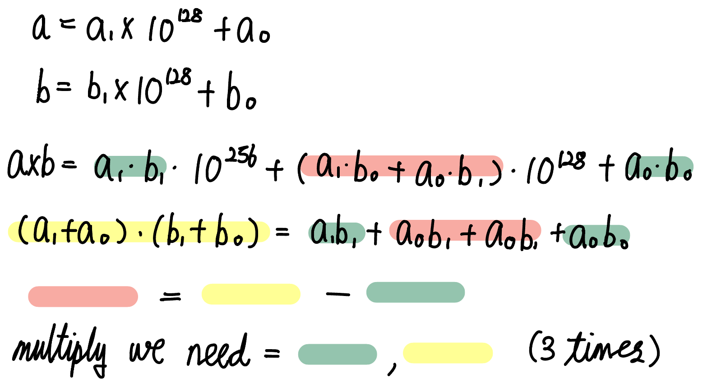

from [[algorithm]]

## 1. Introduction
 Divide and Conquer methodology literally divides one problem to two subproblems and get their results with recursion. Ultimately get the problem's result from merging the results of subproblems.
 Difference of Divide and Conquer and recursion is size of subproblem, which is dividing subproblems with similar size in case of Divide and Conquer besides recursion divide one problem to one piece and remains.
 Most of Divide and Conquer algorithm has three steps
1. Dividing one problem to smaller problems
2. merging each result of subproblems into result of one problem
3. base case that small case we could get result of it without dividing it smaller
### Divide and Conquer algorithm returning sum of 1 to n
``` C++
int fastSum(int n)
{
    if(n==1)    return 1;
    if(n%2 == 1) return fastSum(n-1) + n;
    return 2*fastSum(n/2)   + (n/2)*(n/2);
}
```
### Power of matrix
``` C++
// square matrix whose size is n*n
class SquareMatrix;
// function returning identity matrix
SquareMatrix identity(int n);
// function returnng A^m
SquareMatrix pow(const SquareMatrix& A, int m)
{
    if(m == 0)  return identity(A.size());
    if(m % 2 > 0) return pow(A, m/2) * A;   // prevent overlapping computation
    SquareMatrix half = pow(A, m/2);
    return half * half;
}
```
### Multiply two big numbers


```C++
// compute digits
void normalize(vector<int>& num)
{
    num.push_back(0);
    for(int i = 0 ; i<num.size() ; i++)
    {
        if(num[i]<0)
        {
            int borrow = (abs(num[i]) + 9) / 10;
            num[i+1] -= borrow;
            num[i] += borrow * 10;
        }
        else
        {
            num[i+1] += num[i]/10;
            num[i] %= 10;
        }
    }
    while(num.size() > 1 && num.back() == 0)    num.pop_back();
}
// returning multiplication of two numbers
vector<int> multiply(const vector<int>& a, const vector<int>& b)
{
    vector<int> c(a.size() + b.size() + 1, 0);
    for(int i = 0 ; i<a.size() ; i++)
    {
        for(int j = 0 ; j<b.size() ; j++)
            c[i+j] += a[i] * b[j];
    }
    normalize(c);
    return c;
}
// implement a += b*(10^k)
void addTo(vector<int>& a, const vector<int>& b, int k);
// a -= b, if a >= b
void subForm(vector<int>&a, vector<int>& b);
// return multiply of two numbers
vector<int> karatsuba(const vector<int>& a, const vector<int>& b)
{
    int an = a.size(), bn = b.size();
    // swap if a is shorter than b
    if(an<bn)   return karatsuba(b,a);
    // base case : a or b is empty
    if(an==0 || bn==0)  return vector<int>();
    // base case : switch to simple multiplication if a is short enough
    if(an<=50)  return multiply(a, b);
    int half = an / 2;
    vector<int> a0(a.begin(), a.begin() + half);
    vector<int> a1(a.begin(), a.begin() + half, a.end());
    vector<int> b0(b.begin(), b.begin() + min<int>(b.size(), half));
    vector<int> b1(b.begin() + min<int>(b.size(), half), b.end());
    vector<int> z2 = karatsuba(a1, b1);
    vector<int> z0 = karatsuba(a0, b0);     
    addTo(a0, a1, 0);   addTo(b0, b1, 0);
    vector<int> z1 = karatsuba(a0, b0);     // to subproblem
    subForm(z1, z0);
    subForm(z1, z2);

    // merge
    vector<int> ret;                        
    addTo(ret, z0, 0);
    addTo(ret, z1, half);
    addTo(ret, z2, half + half);
    return ret;
}
```

### Reverse quad tree
```C++
// https://algospot.com/judge/problem/read/QUADTREE
string reverse(string::iterator& it)
{
    char head = *it;
    ++it;

    if(head=='b' || head=='w')
        return;
    string upperLeft = reverse(it);
    string upperRight = reverse(it);
    string lowerLeft = reverse(it);
    string lowerRight = reverse(it);

    return string("x") + lowerLeft + lowerRight + upperLeft + upperRight;
}
```

### FENCE (get the biggest area of graph)
```C++
// https://www.algospot.com/judge/problem/read/FENCE
// height of each fence
vector<int> h;
// get the biggest rectangle area from left to right
int solve(int left, int right)
{
    // only one fence remained
    if(left == right)   return h[left];
    int mid = left + (right - left)/2;
    // divide problem n/2, n/2
    int ret = max(solve(left, mid), solve(mid+1, right));
    // get biggest rectangle between [mid]
    int lo = mid, hi = mid+1;
    int height = min(h[lo], h[hi]);
    ret = max(ret, height * 2);     // mid~mid+1
    while(left<lo || hi<right)
    {
        if(hi<right && (lo==left || h[lo-1]<h[hi+1]))
        {
            hi++;
            height = min(height, h[hi]);
        }
        else
        {
            lo--;
            height = min(height, h[lo]);
        }
        ret = max(ret, height * (hi - lo + 1));
    }
    return ret;
}
```

### FANMEETING
```C++
// https://www.algospot.com/judge/problem/read/FANMEETING
void normalize(vector<int>& nums)
{
    num.push_back(0);

    for(int i = 0 ; i<n ; i++)
    {
        if(nums[i]<0)
        {
            int borrwos = (abs(nums[i]) + 9) / 10;
            nums[i+1] -= borrow;
            nums[i] += borrow * 10;
        }
        else
        {
            nums[i+1] += nums[i] / 10;
            nums[i] %= 10;
        }
    }
    while(nums.size()>1 && nums.back() == 0)    num.pop_back();
}
vector<int> multiply(const vector<int>&a, const vector<int>&b)
{
    vector<int> c(a.size() + b.size() + 1, 0);
    for(int i = 0 ; i<a.size() ; i++)
    {
        for(int j = 0 ; j<b.size() ; j++)
            c[i+j] += a[i] * b[j];
    }
    return c;
}
void addTo(vector<int>& a, const vector<int>& b, int k);
void subFrom(vector<int>& a, const vector<int>& b);
vector<int> karatsuba(const vector<int>& a, const vector<int>& b)
{
    int an = a.size(), bn = b.size();
    if(an<bn)   return karatsuba(b,a);
    if(an == 0 || bn == 0)   return vector<int>();
    if(an<=50)  return multiply(a,b);
    
    int half = an/2;
    vector<int> a0(a.begin(), a.begin() + half);
    vector<int> a1(a.begin() + half, a.end());
    vector<int> b0(b.begin(), b.begin() + half);
    vector<int> b1(b.begin() + half, b.end());

    vector<int> z2 = karatsuba(a1, b1);
    vector<int> z0 = karatsuba(a0, b0);

    addTo(a0, a1, 0);   addTo(b0, b1, 0);
    vector<int> z1 = karatsuba(a0, b0);
    subForm(z1, z0);
    subForm(z1, z2);

    vector<int> ret;
    addTo(ret, z0, 0);
    addTo(ret, z1, half);
    addTo(ret, z2, half+half);
    return ret;
}

int hugs(const string& members, const string& fans)
{
    int n = members.size(), m = fans.size();
    vector<int> a(n), b(m);
    for(int i = 0 ; i<n ; i++) a[i] = (members[i] == "M");
    for(int i = 0 ; i<m ; i++) b[m-i-1] = (fans[i] == "M");
    vector<int> C = karatsuba(a, b);
    int allHugs = 0;
    for(int i = n-1 ; i<n ; i++)
    {
        if(C[i] == 0)
            ++allHugs;
    }
    return allHugs;
}
```


