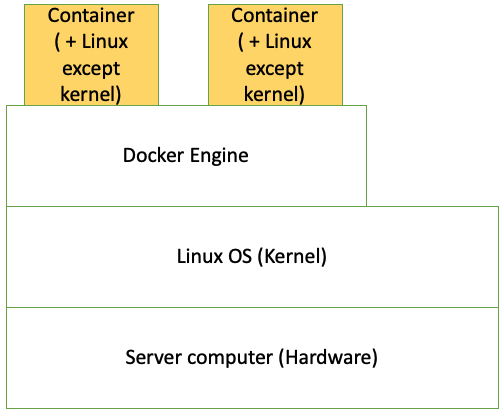
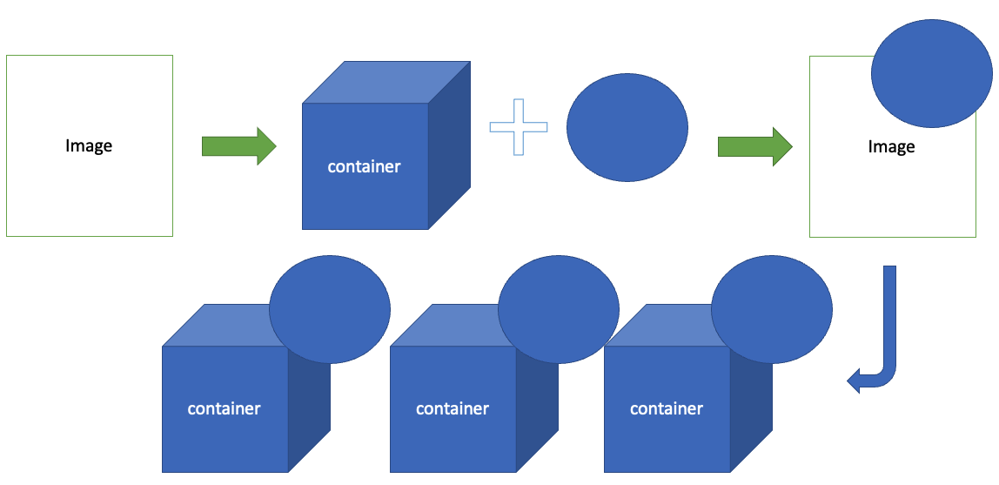

## Architecture of Docker

In Docker environment, containers run above docker engine and docker engine runs above operating system. Every container contains part of Linux OS which is Linux OS excpet kernel becuase containers are seperated individually. So, Part of Linux in container gets commands from program and delivers them to Kernel.

## Image and Container
> Image is blueprint for container
- Both of ways, image to container and container to image, are possible
- If we modify a container and make an image from this, we could make bunch of modified container
- We can get same effect with moving container as expoerting image to other machines

## Life cycle of Docker
Docker periodically discards old containers to new containers to enhance the advantage of docker which is lightness.
- To prevent unwilling loss of data, usually docker mounts disk of server to store data of the containers

