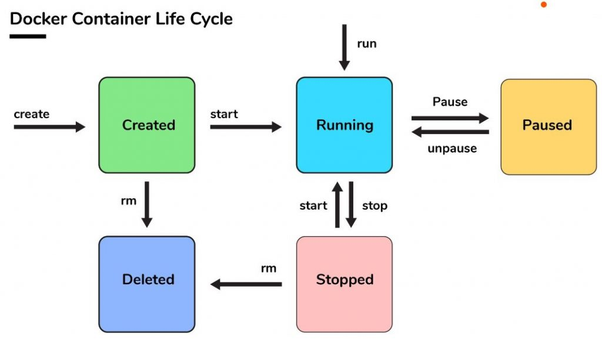

## docker run, stop, rm



### docker run
This command includes three original commands, docker create, docker start, docker pull. Docker recommands to use **docker run** instead of above three commands

### docker stop
If you want to remove operating containers, you need to stop the containers first.

### docker rm
This commands erase stopped container.

### docker ps
Above commands show list of existing containers, which contains state of the container such as **container id**, **image**, **port**, **name**.

<hr>

## Practice Code

```shell
docker run --name [container name] -d httpd
docker ps
docker stop [container name]
docker ps
docker ps -1
docker rm [container name]
docker ps -a
```