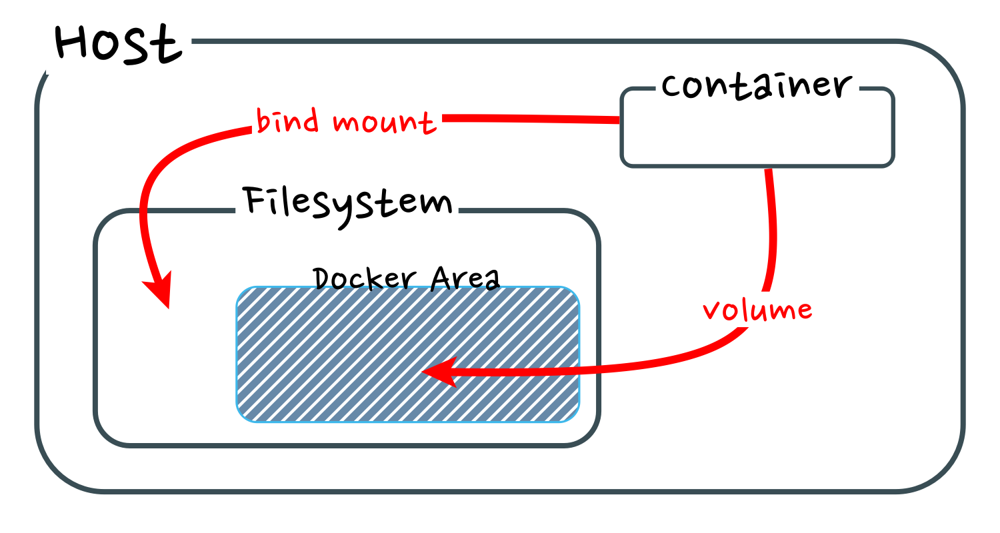

## File copy
In Docker, file copying involves transferring files between local system and a Docker container. Docker provides a built-in command called **`docker cp`** that allows us to copy files or directories to and from running containers.

```
// host -> container
docker cp {host_file_path} {container name or id}:{container_file_path}

// container -> host
docker cp {container_name_or_id}:{container_file_path}
```

## Volume Mount
A volume in Docker refers to a separated area of storage that can be used to store data persistently. It provides a mechanism for containers to store and access data even if the container is replaced or terminated. Volumes are independent of container lifecycles and allow for data sharing and persistence between containers.
On the other hand, mounding is the process of connecting an external storage object, such as a volume, to the operating system of container or host. When a volumes is mounted, it becomes accessible to the software or operating system, enabling it to manage the storage and interact with the data stored within the volume.
The need for storing container data in seperate are, such as the host's storage, arises from the characteristic of contianers to be efficient by replacing themselves. When a container is replaced or terminated, any data stored within the continer would be lost. By using volumes and mounting, data can be stored outside the container, ensuring persistence and enabling the container to access and manipulate the data even after replacement or terminated.

### Type of Storage Mount



### Volume Mount
**Volume Mount** connects a volume managed by the Docker engine to a container as a disk. It is commonly used for temporary storage or infrequently accessed file. This methods allows containers to read from and write to the volume, providing a way to share data between the container and the host system. 

### Bind Mount
**Bind Mount** connects existing file or directory of host computer to path of container to store frequent accessed file

### Difference of Volume mount and Bind Mount
Volume mounts are managed by Docker and provide an isolated and self contained way to store and share data between containers. Bind mounts, on the other hand, link specific directories or files on the host system to the container, enabling **direct access and modification of host files from within the container**. Docker official document recommends volume mount due to usuability, however, bind mount shows better performance in case of you have to edit file frequently.

```
docker volume create {volume_name}

docker volume rm {volume_name}

docker run -v {storage_path}:{container_mount_path}

docker run -v {volume_name}:{container_mount_path}
```

### How to check Volume Mount?

```docker inspect {container_name_or_id} -- format '{{.Mounts}}'``` command shows the source and target paths of each mount, which indicate the location of the mounted volume on the host system and within the container

### Volume back-up
1. Identify the Volume
2. Create a Backup Directory
3. Backup the Volume
```
docker run -v {volume_name_or_id}:{container_file_or_directory_path} -v {path_to_backup_directory}:/{backup_directory_path} {image_name} tar -czvf /{backup_directory}/{backup_name}.tar.gz -C /{container_file_or_directory_path}
```
This {backup_name}.tar.gz file can be used to restore the data or transfer it to another environment if needed.