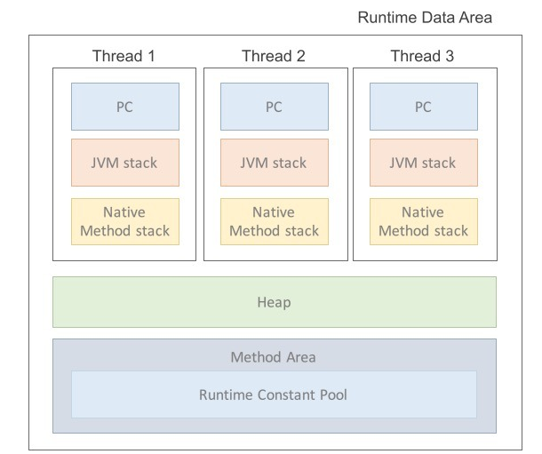

The runtime data areas are the regions of memory that the JVM uses during the execution of a Java program. The JVM uses these areas to allocate and manage memory for the program.

### The Heap
- A shared memory region that is used to store objects and arrays in Java
- In case of sharing same instance or using class variable, synchronization problem occured becuase all thread can access to heap
- Address of object can be referred by variable of method area and stack area

### The Method Area 
- A shared memory region that stores the metadata for the classes and interfaces used by the program, including the bytecode, field and method information, static field and constant pool

### The Java Virutal Machine Stacks
- Each Java thread has its own stack, which is used to store the local variables, method parameters, and intermediate results of the methods called by that thread

### The PC Register
- A register used by the JVM to keep track of the address of the currently executing instruction

### The Native Method Stack
- The Native Method Stack is used to store data related to the execution of native methods, which are methods implemented in a language other thna Java