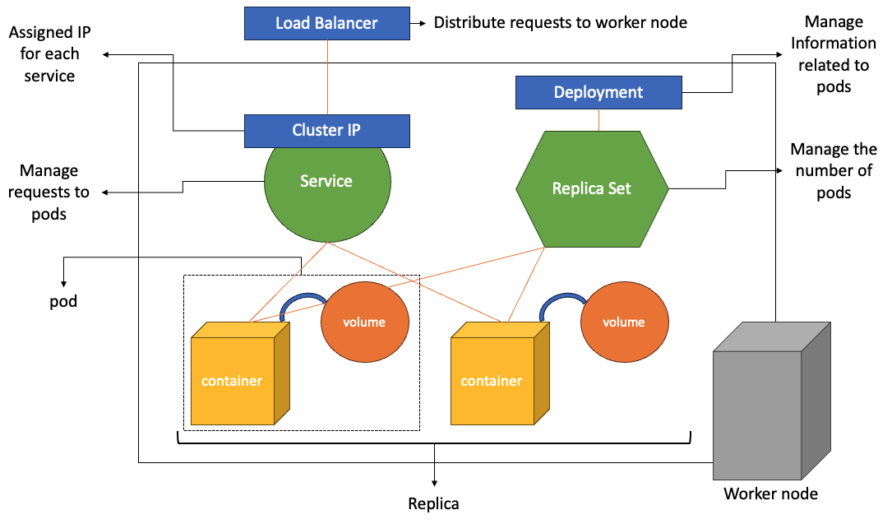

> Kubernetes is an open-source container orchestration platform that automates the deployment, scaling, and management of containerized application

Docker and Kubernetes has difference in various aspect such as scalability, load balancing, rolling updates, roll backs, self-healing and fault tolerance. The main difference between them is self-healing and fault tolerance. Docker involves in the process of creation, on the other hand, kubernetes keep maintaining state of container.

<hr>

## 1. Master Node and Worker Node

### Master Node

> The master node is responsoble for managing the cluster and coordinating all activities within it

- Master Node manage worker node using **contorl plain**
#### Control Plain
- API Server provides a RESTful interface and serves as the entry point for managing the cluster. Users and other components interacts with the cluster through the API server.
- Scheduler is responsible for assigning pods to nodes based on resource requirements, constraints, and policies. It determines where to place the pods within the cluster
- Controller Manager runs various controllers that handle different aspects of the cluster
- **etcd** is a distributed key-value store used for storing the cluster's configuration data and state

### Worker Node

> Worker nodes are the machines where the application workloads run
- The worker nodes are responsible for executing tasks assigned to them by the master node

#### Componenets
- Kube-let runs on each worker node and manages the containers and pods. Kube-let communicates with the master node to receive instructions, starts and stops containers, and reports the node's status
- Kube-proxy is responsible for network communication and implements the Kubernetes Service concept by maintaining network rules and forwarding requests to the appropriate pods

<hr>

## 2. Construction of Kubernetes



- Pod represents a group of one ore more containers that are deployed together on the smae host and share the same network namespace and storage resource. Containers within a pod can communicate with each other using local host. 
- ReplicaSet ensures a specified number of indentical pods are running at all times. It helps with scaling and maintaining the desired number of pod replicas. If a pod fails or is terminated, the ReplicaSet replaces it to maintain the desired state.
- A Deployment is a higher-level abstraction that manages ReplicaSets and provide declarative updates for pods and their associated ReplicaSets. It has information related to pods such as image.
- Service: Abstraction that defines a logical set of pods and a policy to access them. It provides a stable network endpoint for accessing the pods, allowing other pods or external service to connect to them. Services enable load balancing and service discovery within the Kubernetes cluster

<hr>

## 3. Manifest File
> A manifest file is a YAML or JSON file that defines the desired state of Kubernetes objects
Some pieces of information commonly included in a manifest file..
1. Meta data
- Name: The name of resource
- Labels: Key-value pairs used for grouping and selecting resources
- Annotations: Additional metadata or descriptive information about the resource
2. Specification
- Image: The container image to use for the resource
- Ports: The ports exposed by the container for network communication
- Environment Variables: Any environment variables required by the container
- Resources: Limits and requests for CPU and memeory resources
- Replicas: The desired number of replicas for scalable resources like Deployments or ReplicaSets
- Volume Mounts and Volumes
- Service Account

### Label and selector
1. Labels: key-value pairs attached to Kubernetes objects
2. Selector: Selector provides a way to define rules or criteria for selecting specific resource that match the specified label criteria

## 4. Practice with docker desktop

- pod manifest file

```yml
apiVersion: v1
kind: Pod
metadata:
  name: apa000pod
  labels:
    app: apa000kube
spec:
  containers:
    - name: apa000ex91
      image: httpd
      ports:
      - containerPort: 80
```

- deployment manifest file

```yml
apiVersion: apps/v1
kind: Deployment
metadata:
  name: apa000dep
spec:
  selector:
    matchLabels:
      app: apa000kube
  replicas: 3
  template:
    metadata:
      labels:
        app: apa000kube
    spec:
      containers:
      - name: apa000ex91
        image: httpd
        ports:
        - containerPort: 80
```

- Service manifest yml

```yml
apiVersion: v1
kind: Service
metadata:
  name: apa000ser
spec:
  type: NodePort
  ports:
  - port: 8099
    targetPort: 80
    protocol: TCP
    nodePort: 30080
  selector:
    app: apa000kube
```

### Kubernetes command
1. Read manifest file of deployment
```kubectl apply -f {file path and file}```

2. check pods
```kubectl get pods```

3. Delete pods
```kubectl delete pod {podname}```

