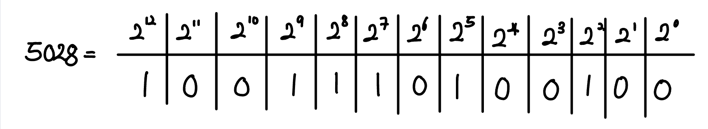

# Bit
> Bit = Binary + Digit

# How to present integer to bit?
## Presentation of positive value

Computer presents positive value with binary number and leading zeors. 15th bit(left) is **most significant bit(MSB)** and 0th bit(right) is **least significant bit(LSB)**.
## Presentation of negative value
#### Negative value is made of one sign bit which is 1 and the number of two's complement. To solve problem occured conducting add calculation, computer send carry from MSB to LSB which is **end-around carry**.

# How to show float?
## Fixed-point
In fixed-point expression, nth bit left to point means 2^(1/2^n). For instance, 10.01 is 2 + 2^(1/4).  
This way consumes too much memory cost to represent all data.
## Floating-point (IEEE)

$N = (-1)^s * M * 2^E$

# Other way of numbering system
- BCD (Binary-coded decimal)
- Octal representation
- Hexadecimal representation

# Name of bit group
|Name|the number of bit|
|nibble|4|
|byte|8|
|half word|16|
|long word|32|
|double word|64|

# Text representation
- ASCII(American Standard Code for Information Interchange)
- UTF-8 (Unicode Transformation Format-8 bit)
    - encoding : bit pattern which is used to present other bit pattern
    - If a character is not in ASCII code, it extends its own length. So in case of ASCII code, it is cost-effective. 

# Presenation of number with character
## Quoted-Printable encoding
- Encoding for sending 8 bits data with 7 bits only communication path (email)
- "=" == 3D, "    " == 09, " " == 20
- max length for one line = 76
- soft line break = a line end with "="
Expression = "=" + "hexadecimal number" + "hexadecimal number"

## base64 encoding

# Presentation of color
## RGBalpha

#### alpha = transparent
- encoding : hex triplet

# Bit
> Bit = Binary + Digit

# How to present integer to bit?
## Presentation of positive value

Computer presents positive value with binary number and leading zeors. 15th bit(left) is **most significant bit(MSB)** and 0th bit(right) is **least significant bit(LSB)**.
## Presentation of negative value
#### Negative value is made of one sign bit which is 1 and the number of two's complement. To solve problem occured conducting add calculation, computer send carry from MSB to LSB which is **end-around carry**.

# How to show float?
## Fixed-point
In fixed-point expression, nth bit left to point means 2^(1/2^n). For instance, 10.01 is 2 + 2^(1/4).  
This way consumes too much memory cost to represent all data.
## Floating-point (IEEE)

$N = (-1)^s * M * 2^E$

# Other way of numbering system
- BCD (Binary-coded decimal)
- Octal representation
- Hexadecimal representation

# Name of bit group
|Name|the number of bit|
|nibble|4|
|byte|8|
|half word|16|
|long word|32|
|double word|64|

# Text representation
- ASCII(American Standard Code for Information Interchange)
- UTF-8 (Unicode Transformation Format-8 bit)
    - encoding : bit pattern which is used to present other bit pattern
    - If a character is not in ASCII code, it extends its own length. So in case of ASCII code, it is cost-effective. 

# Presenation of number with character
## Quoted-Printable encoding
- Encoding for sending 8 bits data with 7 bits only communication path (email)
- "=" == 3D, "    " == 09, " " == 20
- max length for one line = 76
- soft line break = a line end with "="
Expression = "=" + "hexadecimal number" + "hexadecimal number"

## base64 encoding

# Presentation of color
## RGBalpha

#### alpha = transparent
- encoding : hex triplet

