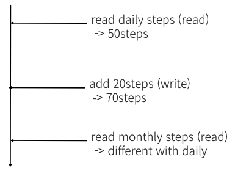
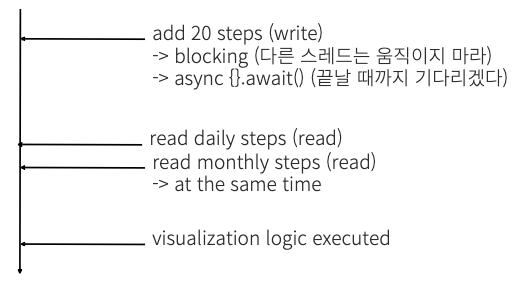
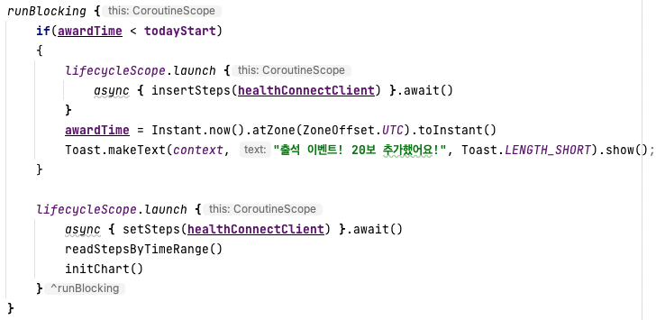

## Project Issue

Due to "Health Connect" application which collect various data from healthcare application also provides bio information like steps and heart rate, the team assumed multiple concurrency issues could be occured.

The issues from external application ecosystem could not be resolved by team's application layer, though, me and my teammates determined to use async and runBlocking blocks to prevent pollution of data or early accessing by other componenets.

What if we coded just like function A(); function B(); blah blah.. Maybe, some data from fitness application or sequence of function would be changed like below figure because of delay function in write operation. 

Consequencely, the right sequence of function is below.

---

## When threads or thread pools can be create in Anroid Studio

1. Main Thread: The main thread, also known as the UI thread, is automatically created by the Android system when the application starts
- This thread is responsible for handling user interface updates and events

2. Background Threads: Additional threads can be created manually in Android applications to offload time-consuming tasks or perform work in the background

3. AsyncTask: provides a convenient way to perform background operations on a separate thread and update the UI thread with the results

4. Executors and Thread Pools: allow you to create and manage thread pools
- You can submit tasks to these thread pools for concurrent execution

5. Kotlin coroutines: Coroutine can be used to perform asynchronous operations and manage concurrency in more declarative and sequential manner

## Coroutine

Before jump in to the world of Kotlin concurrency management, you need to know the concept of coroutine. 
> Coroutines are a way to write code that can be paused and resumed later without blocking the thread it runs on.

### Starting a new coroutine
###### Kotlin Official Documentation

In Kotlin, coroutine follow a principle of structured concurrency which means the new coroutines can only be launched in a specific **CoroutineScope** which delimits the lifetime of the coroutine.
This CoroutineScope seperates to runBlocking and coroutineScope. The main difference of them is **blocking the current thread for waiting** or not. In case of runBlocking, it blocks all current thread for waiting which means blocks other UI componenet too. While coroutineScope just only suspneds, releasing the underlying thread for other usages.

coroutine run on top of threads and can be suspended. When a coroutine is suspended, the corresponding computation is paused, removed from the thread, and stored in memory.

---

Above code is simple implementation of proper flow in the service. 

First of all, runBlocking paragraph blocks every threads until all inner function finish their work properly and seperates main code area which has no dependency with service logic.

Following designated service logic, execute insertSteps function if user is not awarded today with async paragraph and await() function which stand for stop execution of below code until the functions inside of async paragraph are ended.

Same with insertSteps function, setSteps function retrieve steps from "Health Connect" application with response. Also below codes wait for ending of the function because of await() function.

Then, display data on screen after all retrieve or create logic.

The reason why we could use coroutine and async statement is the main logic inside of coroutineScope had no dependency with outside code such as UI componenets, external service logic.

Especially, brief and capsulated code let us be able to unify whole service logic into one coroutine block.

---

## Conclusion
my first project was an incredible journey into the world of concurrency! It opened my eyes to the importance of managing multiple tasks in applications like e-commerce and banks. I was amazed by how coroutines allowed me to handle asynchronous operations in a more intuitive and readable way.

And let me tell you, Kotlin's null safety feature was a game-changer! It taught me to be extra cautious when dealing with exceptions and null values, making my code more robust and reliable.

Feeling inspired, I've decided to share more stories about my experiences with concurrency, as well as the intriguing concepts of blocking and non-blocking actions in real-world work environments.

I'm thrilled to continue this adventure and see where it takes me. The world of concurrent programming holds endless possibilities, and I can't wait to explore them further!