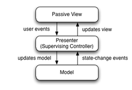

> MVC pattern provides a structured approach to desinging and organizing user interface code, ensuring a clear separation between data, presentation, and user interface

1. **Model**: The model represents the application's data and business logic
- It encapsulates the data and provides methods to manipulate and access it
- The model component is independent of the user interface and does not directly interact with it
2. **View**: The View is responsible for rendering the user interface
- It displays the data from the model and interacts with the user
- It receives input from the user and sends it to the Controller for further processing
3. **Controller**: The Controller handles the user's input and acts as an intermediary between the Model and the View
- It receives input from the user via the View and processes it
- Based on the input, the Controller may update the Model, retrieve data from model, or change the current View

### The flow of the MVC pattern
1. The user interacts with the View by providing input
2. The View forwards the ionput to the Controller
3. The Controller processes the input and updates the Model if necessary
4. The Model notifies the View and the Controller about any changes in the data
5. The view fetches the updated data from the Model and updates its display

## MVP Pattern
> MVP pattern is devided as three parts

1. Model
2. View
3. **Presenter**: The presenter acts as the mediator between the Model and the View. It receives user input from the View, processes it, and interacts with the Model to update the data. It also updates the View with the latest data from the Model.

#### Difference with MVC Pattern
The Presenter and the View have a stronger relationship compared to the View and the Controller in MVC. 
-> The presenter typically holds a reference to the View and updates it directly

## MVVM Pattern

> It inroduces a new component called the ViewModel, which is responsible for managing the presentation logic and state of the View

1. Model
2. View
3. **ViewModel**: The ViewModel acts as an intermediary between the View and the Model. It exposes the data and operations needed by the View, often in the form of properties and commands. The ViewModel also handles user interactions and updates the Model accordingly.

- The key concept in MVVM is data binding.The View binds to properties exposed by the ViewModel, allowing for automatic synchronization of data between the View and the ViewModel
- MVP and MVVC aim to reduce direct dependencies between the components