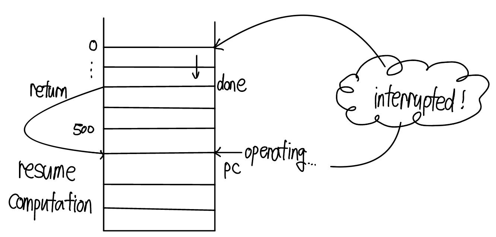
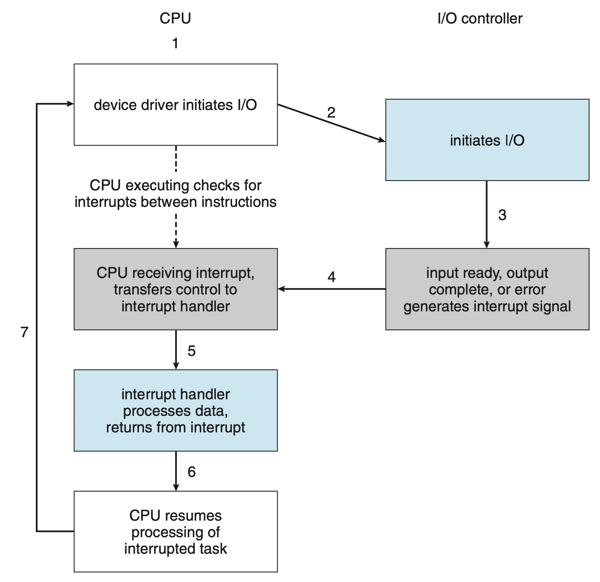
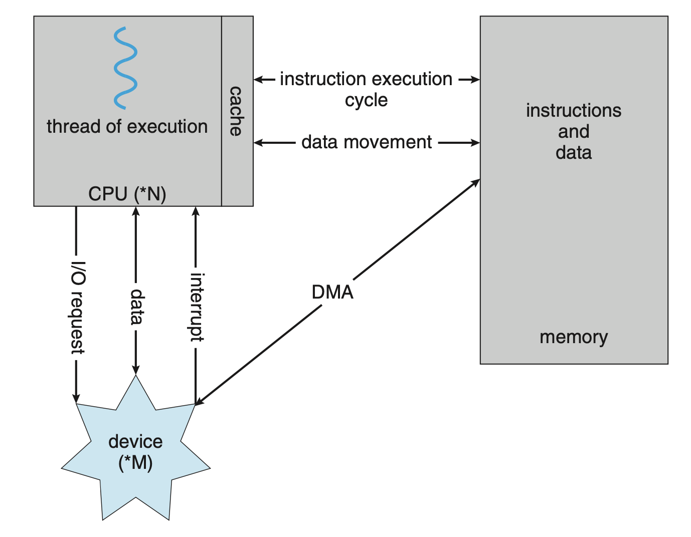

> An operating system is software that manages a computer's hardware. It also provides a basis for application programs and acts as an intermediary between the computer user and the computer hardware.

## 1.1 What Operating Systems Do
A computer system can be divided roughly into four components : the hardware, the operating system, the application programs and a user. The hardware provides the basic computing resources for the system. The application programs definde the ways in which these resources are used to solve user's computing problems. The operating system controls the hardware and coordiantes its use among the various application programs for the various users.
### User View
The user's view of the computer varies according to the interface being used. The operating system is designed mostly for **ease of use**, with some attention paid to performance and security and none paid to **resource uilization** - how various hardware and sofrware resources are shared. 
### System View
In this context, we can view an operating system as a resource allocator. The operating system acts as the manger of these resources. Facing numerous and possibly conflicting requests for resources, the operating system must decide how to allocate them to specific programs and users so that it can operate the computer system efficiently and fairly. An operating system is a control program. A control program manages the execution of user programs to prevent errors and improper use of the computer.
### Defining Operating System
The fundamental goal of computer system is to execute programs and to make solving user problems easier. The operating system is the one program running at all times on the computer - usually called the **kernel**. Along with the kernel, there are two other types of programs: system programs, which are associated with the operating system but are not necessarily part of the kernel, and application programs, which include all programs not associated with the operation of the system. Mobile operating systems often include not only a core kernel but also **middleware** - a set of software frameworks that provide additional services to application developers. 

## 2.1 Computer-System Organization
A modern general-purpose computer system consists of one or more CPUs and a number of device controllers connected through a common bus that provides access between components and shared memory. The device controller is responsible for moving the data between the peripheral devices that it controls and its local buffer storage. Typically, operating systems have a device driver for each device controller. This device driver understands the device controller and provides the rest of the operating system with a uniform interface to the device. The CPU and the device controllers can execute in parallel, competing for memory cycles. To ensure orderly access to the shared memory, a memory controller synchronizeds access to the memory.
 Typically, operating systems have a **device driver** for each device controller. This device driver understands the device controller and provides the result of the operating system with a uniform interface to the device. The CPU and the device controllers can execute in parallel, competing for memeory cycles. To ensure orderly access to the shared memory, a memory controller synchronizes access to the memory. 

### Interrupts

 To start an I/O operation, the device controller loads the appropriate registers in the device controller. The device controller, in turn, examines the contents of these registers to determine what action to take. The controller starts the transfer of data from the device to its local buffer. 
 The device driver then gives control to other parts of the operating system, possibly returning the data or a pointer to the data if the operation was a read.

#### Overview
Hardware may trigger an interrupt at any time by sending a signal to the CPU, usually by way of the **system bus**. When the CPU is interrupted, it stops what it is doing and immediately transfers execution to a fixed location. The fixed location usually contains the starting address where the service routine for the interrupt is located. The interrupt service routine executes; on completion, the CPU resumes the intterupted computation. 

A table of potiners to interrupt routines can be used instead ot provide the necessary speed. The interrupt routine is called indirectly through the table, with no intermediate routine needed. Generally, the table of pointers is stored in low memory. This array, or **interrupt vector**, of addresses is then indexed by a unique number, given with the interrupt request, to provide the address of the interrupt service routine for the interrupting device. Operating systems as different as Windows and UNIX dispatch interrupts in this manner. If the interrupt routine needes to modify the processor state, it must explictly save the current state and then restore that state before returning. After the interrupt is services, the saved return address is loaded into the program counter, and the interrupted computation resumes as though the interrupt had not occured.

#### Implementation
The CPU hardware has a wire called the **interrupt-request line** that the CPU senses after executing every instruction. When the CPU detects that a controller has asserted a signal on the interrupt-request line, it reads the interrupt number and jumps to the **interrupt-handler routine** by using that interrupt number as an index into the interrupt vector. The interrupt handler saves any state it will be chaning during its operations, determines the cause of the interrupt,  performs the necessary processing, performs a state restore, and executes _return-from-interrupt_ instruction to return the CPU to the execution state prior to the interrupt. We say that the device controller **raises** an interrupt by asserting a signal on the interrupt request line, the CPU **catches** the interrupt and **dispatches** it to the interrupt handler, and the handler **clears** the interrupt by servicing the device. 
1. We need the ability to defer interrupt handling during critical processing. 
2. We need an efficient way to dispatch to the proper interrupt handler for a device.
3. We need multilevel interrupts, so that the operating system can distinguish between high- and low- priority interrupt and can respond with the appropriate degree of urgency.
__In modern cimputer hardware, these three features are provided by the CPU and the **interrupt-controller hardware**.

Most CPUs have two interrupt request lines. One is the **nonmaskable interrupt**, which is reserved for event such as unrecoverable memory errors. The second interrupt line is **maskable**: it can be turned off by the CPU before the execution of critical instruction sequences that must not be interrupted. The maskable interrupt is used by device controllers to requst services. 
Interrupt chaining is each element in the interrupt vector points to the head of a list of interrupt handlers. When an inerrupt is raised, the handlers on the corresponding list are called one by one, until one is found that can service the request. This structure is a compromise between the overhead of a huge interrupt table and the inefficiency of dispatching to a single interrupt handler. 
The events from 0 to 31, which are nonmaskable, are used to signal various error conditions. The events from 32 to 255, which are maskable, are used for purposes such as device-generated interrupts. The interrupt mechanism also implements a system of **interrupt priority levels**. These levels enable the CPU to defer the handling of low-priority interrupts without masking all interrupts and makes it possible for a high-priority interrupts to preempt the execution of a low-priority interrupt.

### 2.2 Storage Structure
The CPU can load instructions only from memory, so any programs myst first be loaded into memory to run. General-purpose computers rum most of their programs from rewritable memory, called main memory (also called random-access memory, RAM). Main memory commonly is implemented in a semiconductor technology called dynamic random-access memory(DRAM). Computers use other forms of memory as well. For example, the first program to run on computer power-on is a **bootstrap program**, which then loads the operating system. Since RAM is **volatile** - loses its content when power is turned off or otherwise. Instead, for this and some other purposes, the computer uses electrically erasable programmable read-only memory(EEPROM) and other forms of **firmware** - storage that is infrequently written to and is nonvolatile. EEPROM can be changed but cannot be changed frequently. In addition, it is low speed, and so it contains mostly static programs and data that aren't frequently used. 

|byte|8bits|
|word|8bytes|
|kilobyte|1024 bytes|
|megabyte|1024^2 bytes|
|gigabyte|1024^3 bytes|
|terabyte|1024^4 bytes|
|petabyte|1024^5 bytes|

All forms of memory provide an array of bytes. Each byte has its own address. Interaction is achieved through a sequence of _load_ or _store_ instructions to specific memory addresses. The _load_ instruction moves a byte or word from main memory to an internal register within the CPU, whereas the _store_ instruction moves the content of a register to main memory. Aside from explicit loads and stores, the CPU automatically loads instructions from main memory for execution from the location stored in the **program counter**. 
A typical instruction-execution cycle, as executed on a system with a **Von Neumann architecture**, first fetches an instruction from memory and stores that instrcution in the **instruction register**. The instruction is then decoded and may cause operands to be fetched from memory and stored in some internal register. After the instrction on the operands has been executed, the result may be stored back in memory. We are interested in the sequence of memory addresses generated by the running program.
Ideally, we want the programs and data to reside in main memory permanently. This arrangement usually is not possible on most systems for two reasons:
1. Main memory is usually too small to store all needed programs and data permanently.
2. Main memory, as mentioned, is volatile - it loses its contents when power is turned off or otherwise lost.
Thus, the most computer system provide **secondary storage** as an extension of main memory. The main requirement for secondary storage is that it be able to hold large quantities of data permanently. The most common secondary-storage devices are **hard-disk drives(HDDs)** and **nonvolatile memory(NVM) devices**, which provide storage for both programs and data. Most programs are stored in secondary storage until they are loaded into memory. Many programs then use secondary storage as both the source and the destination of their processing. Secondary storage is also much slower than main memory. 
**Tertiary storage** is slow enough and large enough that they are used only for special purposes - to store backup copies of material stored on other devices. 

The top four levels of memory in the figure are constructed using **semi-conductor memory**, which consists of semiconductor-based electronical circuits. NVM devicesm at the fourth level, have several variants but in general are faster than hard disk. The most common form of NVM device is flash memory.
- Volatile storage will be referred to simply as **memory**. If we need to emphasize a particular type of storage devicde.
- Nonvolatile storage retains tis contents when power is lost. It will be referred to as NVS.
    - Mechanical : HDDs
    - Electrical : NVM
Mechanical storage is generally larger and less expensive per byte than electrical storage. Caches can be installed to improve performance where a large disparity in access time or transfer rate exists between two components.

### 2.3 I/O 

The form of interrupt-driven I/O described in Section 1.2.1 is fine for moving small amounts of data but can produce high overhead when used for bulk data movement such as NVS I/O. To solve this problem, **direct memory access(DMA)** is used. After setting up buffers, pointers and counters for the I/O device, the device controller transfers an entire block of data directly to or from the device and main memory, with no intervention by the CPU. Only one interrupt is generated per block, to tell the device driver that their operation has completed, rather than the one interrupt per byte generated for low-speed devices. While the device controller is performing these operations, the CPU is available to accomplish other work.