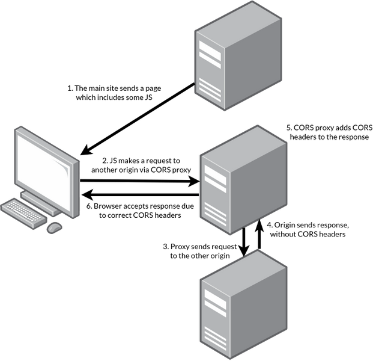

- From [[designpattern]]

> The proxy pattern is a design pattern that allows for the creation of a surrogate or placeholder object to control access to another object, challed the real subject
- Real Subject: The object that the proxy represents and controls access to. It defines the core functionality that the client wants to access
- Proxy: An object that acts as a substitute for the real subject. It implements the same interface as the real subject, allowing the client to interact with it.
- Client : The object that interacts with the proxy to access the real subject. The client is unaware of whether it is working with the real subject or the proxy since they both adhere to the same interface

## CloudFare for Proxy Server
> Cloudfare is a cloud-based service that provides content delivery, security and performance optimization features.
- Content Delivery Network(CDN) : Cloudfare operates a distributed network of servers worldwide. When a visitor requests a resource from a website, Cloudfare's CDN serves the content from the nearest data center, reduing latency and improving page load times
- DDoS Protection: It analyzes imcoming traffic, filters out malicious requests, and absorbs the attack traffic across its network
- SSL/TLS encryption: Cloudfare offers SSL/TLS certificates and handles the encryption and decryption of website traffic

## CORS and Proxy Server of front-end
>CORS(Cross-Origin Resource Sharing) is a mechanism implemented in web browsers that allows web pages to make requests to a different domain than the one the page originated from

To overcome CORS restrictions during development, a proxy server can be set up. The client's request are directed to the proxy server,which then forwards the request to the intended server. The response from the server is sent back to the client through the proxy. Since the client's request are being made to the same domain as the web page, there are no CORS restriction.