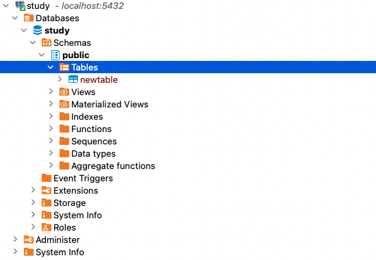

## Virutal Environment
Make a virtual environment
```shell
python3 -m venv {virtual environment name}
```

Activate the virtual environment
```shell
source {virtual environment name}/bin/activate
```

## Making Django project
```shell
django-admin startproject {project name} .
```

Activate server
```shell
python manage.py runserver
```

## View
1. Create views.py
```python
from django.http import HttpResponse
def main(request):
    return HttpResponse("{content of response}")
```

```python
from django.shortcuts import render

def main(request):
    return render(request, "main.html")
```

## URLconf
```python
# from django.contrib import admin
# from django.urls import path
from config.views import main

urlpatterns = [
    # path("admin/", admin.site.urls),
    path("", main),
]
```

## Template
1. add template directory in **settings.py**
```python
# BASE_DIR = Path(__file__).resolve().paretn.parent
TEMPLATES_DIR = BASE_DIR / "templates"
```
```python
TEMPLATES = [
    {
        "DIRS" : [TEMPLATES_DIR],
    },
]
```

## Database and Django
### Application
```shell
> python manage.py startapp {application name}
```
1. Add new applicatio in "INSTALLED_APPS" list
2. Make new model
```python
class {model name}:
    name = models.IntegerField(default=0)
    ...
```
3. migration
```shell
> python3 manage.py migrate
```

### Database installation
> recommanding tool : DBeaver
1. Postgresql installation
```shell
brew install postgresql@14
```
2. Execution
```shell
brew services restart postgresql@14
```
3. Connect to Postgresql
```
> psql postgres
```
\du : command that list users in table

4. Create database
```
CREATE DATABASE {database name} \g
```

5. Create user
```
create user {username} with encrypted password {password} \g
```

6. Give database creation permission to user
```
alter user {username} createdb \g
```

7. Give all permission to user
```
grant all privileges on database {database name} to {username} \g
```
> additional privilege info. is below


\list : listing tables

8. Connect to database
```
\connect {database name}
```

9. Access to database with other user permission
```
\q
psql postgres -U testuser
```
'#' : superuser

### Create new table



1. Making emp table
```sql
CREATE TABLE dept (
    deptno    NUMERIC CONSTRAINT PK_DEPT PRIMARY KEY,
    dname    VARCHAR(14) ,
    loc        VARCHAR(13) 
) ;
```
```sql
CREATE TABLE emp (
    empno    NUMERIC CONSTRAINT PK_EMP PRIMARY KEY,
    ename    VARCHAR(10),
    job        VARCHAR(9),
    mgr        NUMERIC,
    hiredate    DATE,
    sal        NUMERIC(7,2),
    comm    NUMERIC(7,2),
    deptno    NUMERIC(2) CONSTRAINT FK_DEPTNO REFERENCES DEPT 
);
```

2. Put some data
```sql
-- Insert test data - dept
INSERT INTO dept VALUES    (10,'ACCOUNTING','NEW YORK');
INSERT INTO dept VALUES (20,'RESEARCH','DALLAS');
INSERT INTO dept VALUES    (30,'SALES','CHICAGO');
INSERT INTO dept VALUES    (40,'OPERATIONS','BOSTON');
-- Insert test data - emp
INSERT INTO emp VALUES (7369,'SMITH','CLERK',7902,to_date('17-12-1980','dd-mm-yyyy'),800,NULL,20);
INSERT INTO emp VALUES (7499,'ALLEN','SALESMAN',7698,to_date('20-2-1981','dd-mm-yyyy'),1600,300,30);
INSERT INTO emp VALUES (7521,'WARD','SALESMAN',7698,to_date('22-2-1981','dd-mm-yyyy'),1250,500,30);
INSERT INTO emp VALUES (7566,'JONES','MANAGER',7839,to_date('2-4-1981','dd-mm-yyyy'),2975,NULL,20);
INSERT INTO emp VALUES (7654,'MARTIN','SALESMAN',7698,to_date('28-9-1981','dd-mm-yyyy'),1250,1400,30);
INSERT INTO emp VALUES (7698,'BLAKE','MANAGER',7839,to_date('1-5-1981','dd-mm-yyyy'),2850,NULL,30);
INSERT INTO emp VALUES (7782,'CLARK','MANAGER',7839,to_date('9-6-1981','dd-mm-yyyy'),2450,NULL,10);
INSERT INTO emp VALUES (7788,'SCOTT','ANALYST',7566,to_date('13-07-87','dd-mm-yyyy')-85,3000,NULL,20);
INSERT INTO emp VALUES (7839,'KING','PRESIDENT',NULL,to_date('17-11-1981','dd-mm-yyyy'),5000,NULL,10);
INSERT INTO emp VALUES (7844,'TURNER','SALESMAN',7698,to_date('8-9-1981','dd-mm-yyyy'),1500,0,30);
INSERT INTO emp VALUES (7876,'ADAMS','CLERK',7788,to_date('13-07-87','dd-mm-yyyy')-51,1100,NULL,20);
INSERT INTO emp VALUES (7900,'JAMES','CLERK',7698,to_date('3-12-1981','dd-mm-yyyy'),950,NULL,30);
INSERT INTO emp VALUES (7902,'FORD','ANALYST',7566,to_date('3-12-1981','dd-mm-yyyy'),3000,NULL,20);
INSERT INTO emp VALUES (7934,'MILLER','CLERK',7782,to_date('23-1-1982','dd-mm-yyyy'),1300,NULL,10);
```

3. Use SQL freely from now

#### Join with Django
1. Change DATABASE part of "settings.py"
```python
DATABASES = {
    'default' : {
        'ENGINE' : 'django.db.backends.postgresql',
        'NAME' : {name of database},
        'USER' : {user_id},
        'PASSWORD' : {password},
        'HOST' : {host},
        'PORT' : '',
    }
}

2. Install psycopg2
```shell
pip install psycopg2
```

3. Migration
```shell
python3 manage.py migrate
```

<hr>
