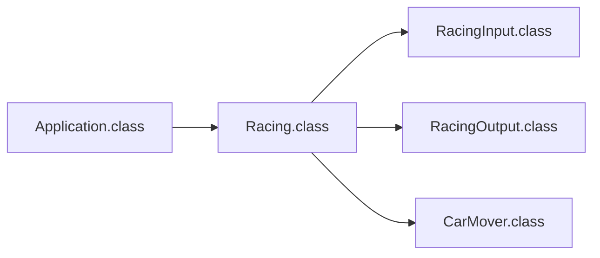
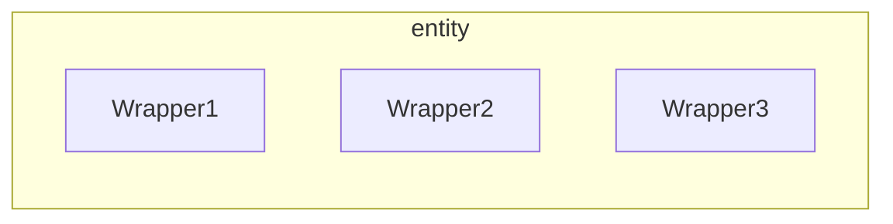

# 일단 후기!
> [!NOTE] 몰입의 즐거움은 끝이 없다.
> 이번 주차에는 함수형 프로그래밍과 객체 지향형 프로그래밍을 직접 비교해보았습니다. 1주차에 놓였던 코딩 컨벤션과 나의 나태함을 다시 고쳐먹고, 테스트 코드도 한 번 짜보고 1주차보다 더 다양한 도전을 할 수 있었어요 😉.
> 처음에는 입출력 범위 등 구체적인 요구사항을 몰라서 꽤 당황스러웠는데, 지금 생각하면 다들 얼마나 창의적이고 효율적인 코드를 짜는지 실험해보고자 일부러 이런 과제를 내시는게 아닐까?라는 생각을 하고 있습니다.
> 이번에는 우테코 자체 테스트 함수, 함수형 프로그래밍의 엄청남❤️에 대해서 이해해보는 시간을 가졌는데, 다음에는 동시성 처리와 도메인 객체의 분리, 더 규격화된 테스트에 도전해보겠습니다❤️‍🔥❤️‍🔥.

---

# 무엇을 고려했나요?🧐
---
## 1차 고민거리
---
### 코딩 컨벤션 이자식..
생각치도 못한 조건, 반복문 조건 사이 공백! 이 자식.. 꼼꼼히 보지 않은 나를 반성한다. 이번 코드는 아주 야무지게 지켜버렸다.


---
### FP(Functional Programming)와 OOP(Object-Oriented Programming)
몰입캠프에 있을 때, 코틀린을 이용한 프로그래밍을 자주 했었는데, 그 때 함수형 프로그래밍의 매력에 아주 홀라당 빠져버렸습니다. 간결함과 무결성이 정말 마음에 들어서 자바는 함수형으로 쓰면 바보같은 거겠지.. 고민하던 도중! 자바에도 FP를 위한 몇몇 기능들이 있다는 반가운 말을 듣고 이번 기회에 도전해 보았어요. 역시 나는 FP가 좋고 앞으로도 애용할 예정입니다!

#### FP와 OOP가 뭐예요?
둘은 어떤 개념을 주로 하느냐에 따라서 다릅니다. 객체지향은 실제 세계 **객체를 모델링**해서, 함수형은 **수학적 함수**를 이용하여 주로 개발합니다. FP를 쓰면 코드가 짧아지는 장점이 있어서 관리에 용이해집니다. 그렇다고 OOP가 별로다!라고 절대적으로 말할 수는 없어요, 서로 대체 관계에 있지 않습니다.
둘은 **상태관리** 부분에서 명백한 차이점을 가지지만, 결국 목표는 둘 다 효과적이고 효율적인 소프트웨어의 개발이니까요! 

#### OOP의 코드 구조

꽤 복잡하군요..! 다음에는 꼭 코드 구조의 개선을 생각해보겠습니다.
일단 Application에서는 정말 Racing 객체를 생성해서 startRacing() 함수를 작동시키는 일 밖에 하지 않습니다.
Racing 객체는 RacingInput, RacingOutput, CarMover 클래스 객체를 이용해 전체 프로그램을 작동시키죠, 일단 RacingInput 객체의 함수들로 입력을 받고, 그 다음 CarMover 클래스로 기존의 Car 객체 배열의 원소를 변경하여 계산을 합니다. 그리고 나서 RacingOutput 객체의 함수로 출력합니다.

### FP의 코드 구조
> [!NOTE] 코드 구조 다이어그램
> 
> 
> 훨씬 간단하네요! 모든 이벤트는 `startRacing()`함수안에서 일어납니다. `carNames()` 메소드로 자동차 이름을 받은 후 `getNumberOfTries()` 메소드로 시도 횟수를 받습니다. 
> 이후에는 순수함수들의 도움을 받아 `carNames` 배열을 `List<Car>` 형으로 반환하고, `tries`번 `moveCars()`와 `printCarDistances()`를 실행합니다. 
> `moveCars()`에서는 랜덤한 숫자를 뽑아 그 숫자가 4이상이면 거리를 증가시키고, 그렇지 않으면 거리를 유지합니다. `printCarDistances()` 메소드에서는 "-"를 distance번 출력합니다.
> 이 메소드들이 종료되면, 가장 길이가 긴 우승자들을 구해 출력합니다.

### 그래서 뭐가 더 좋은데?
제 개인적인 취향은 **함수형 프로그래밍**이요! 하지만 OOP의 중요성 역시 빼놓을 수 없다고 생각합니다. 하지만 순수 함수와 람다를 자유자제로 쓰며 코드를 단축시켜버리는 함수형 프로그래밍의 위력을 보고 저는.. 함수형으로 마음이 간 것 같습니다. 특히, 높은 불변성과 순수 함수를 통한 예측 가능하고 안정적인 코드 동작이 "아, 정말 세련됐다!"라는 생각을 주더라고요. ==무엇보다 코드 짧은게 너무 좋아요==

---
### 커밋메세지를 의미있게 (너무 긴가?)
제가 사용한 커밋메세지 규칙은 아래와 같습니다.
```markdown
# 단계 분류  
  
# 제목  
MVC 형식을 사용한 코드 작성
  
## 부가설명  
MVC 기반으로 FP 코드의 변경
  
### 이슈 번호 (Optional.)
- #01 solved
```
최대한 많은 정보를 구체적으로 담고자 했는데요. 지금 생각하면 너무 쓸데없이 긴가도 싶고.. 다음에는 더 나은 커밋 규칙을 만들어 보겠습니다.

---
### 우테코 테스트케이스 정복하기
1주차에 저를 가장 당황시킨거는 이 테스트케이스! 당시에는 시간이 없으니까 나중에 해야지 미뤄놓고 이번 주차가 돼서야 분석이 끝나 사용할 수 있었습니다. 디스코드를 보니 이미 많은 참여자들이 해석해 주셨더라고요! 부족하지만 저도 올려봅니다 😉
[여기 클릭해서 타고가기]() ([[woowa-tech-testcode]])

---

# 2차 고민거리 (고민만 함)
멋진 [고베롬](https://berom.tistory.com/) 형님과 함께 코드 리뷰 진행했습니다 💯💯. 그리고 다른 우테코 합격자분들의 코드를 보니까, 정말 멋진 코드들이 많더라고요.. 이 단순한 로직에 MVC 로직을 적용하다니! 역시 고수들의 세계는 다르구나, 나아갈 힘을 얻고 있습니다. 

---
## 뭐라고? 도메인을 나눴다고?
개인적으로는 정말 충격적이었습니다.. 이 작은 로직에 도메인을 나눌 생각을? 역시 이 정도는 해야지 우테코 가는군! 오늘도 한 수 배웁니다.
### 너 내 객체 바꿀라고 했냐? 깡!
`Wrapper`형식의 필요성을 느꼈습니다. 상태 기반으로 관리하다보면 해킹에 매우 취약해지다보니 하하.. 그래서 각 파라미터를 `Wrapper`로 바꾸고 한 `Entity`가 이들을 소유하는 형식이면 더 보안성도 좋고! 유효성 등 복잡한 코드를 각 `Wrapper`에서 처리돼 한 `Entity`를 깔끔히 관리할 수 있게 되거든요!

### MVC를 써봅시다

다음을 위하여 지금 제가 생각해본 흐름을 다이어그램으로 그려봅시다!

일단 DTO는 영 쓸 일이 없을 듯해서, 잠시 빼뒀습니다. 이번 케이스에서는 고려하지 않았어요!
코드는 깃허브에 첨부합니다! [깃허브 링크]()

### 너희가 final 맛을 알어?
> [!NOTE] 생각보다 불변성과 확장 금지는 중요하다
> 


카카오 관계자 분에 의하면 final 사용이 생각보다 중요하다더라.. 불변성을 유지하고 확장을 막는 것이 코드의 보안성을 위해서는 매우 중요!

---
## 순수 함수도 테스팅이 필요해
순수 함수도 테스팅을 권장합니다! 이번에는 OOP를 메인 제출용으로 써서 테스팅을 진행하지 않았지만, 다음부터는 함수형 로직으로 작성하여 테스팅까지 싸악.. 돌려버리겠습니다!


---
# 다음 주차에 도전할 것들
## 동시성 프로그래밍
- 멀티 쓰레딩에 도전해보겠습니다! 세마포어! 락! 도전!
## MVC 제대로 써보자구
- DTO까지 해서 당장이라도 데이터를 쏴버릴 수 있도록 맛있게 만들겠습니다.
## 함수형 프로그래밍과 테스팅