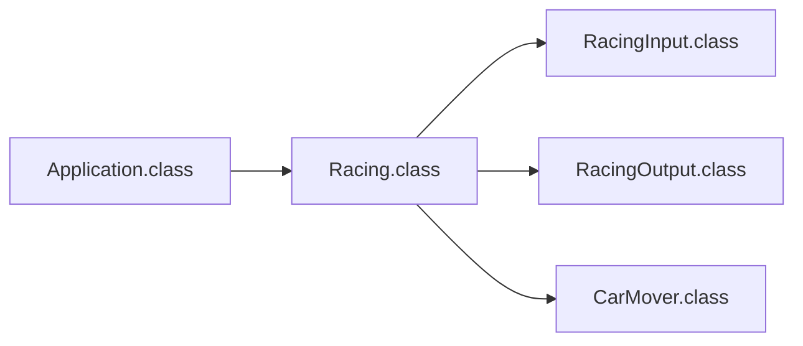

# A Brief Review!
> [!NOTE] The joy of immersion knows no end.
> This week, we had a hands-on comparison of functional programming and object-oriented programming. I revisited the coding convention set in week 1, corrected my own complacency, wrote some test code, and embraced a wider range of challenges than in the first week 😉.
> Initially, I was quite bewildered due to not knowing specific requirements such as input/output ranges, but now I’m pondering whether such assignments were deliberately designed to encourage experimentation with creative and efficient coding.
> This time, I delved into understanding the awesomeness❤️ of functional programming and the in-house testing functions of Wootecho, and next time, I plan to tackle concurrency processing, separation of domain objects, and more standardized testing❤️‍🔥❤️‍🔥.

---

# What Did I Consider?🧐
---
## First Set of Concerns
---
### Coding Convention, you little...
Unexpected requirements, space between loop conditions! I reflect on not being meticulous enough. This time, I strictly adhered to the convention.


---
### FP (Functional Programming) vs. OOP (Object-Oriented Programming)
Back at the immersion camp, I often programmed using Kotlin and totally fell for the charm of functional programming. I loved its brevity and integrity so much that I thought Java would be foolish to use functionally... But during my musings! I was delighted to learn that Java has some features for FP and took this chance to give it a try. Indeed, I prefer FP and plan to continue using it!

#### What are FP and OOP?
They differ based on the concepts they primarily employ. Object-oriented models **real-world objects**, whereas functional programming develops primarily through **mathematical functions**. FP offers the advantage of shorter code, which eases management. However, it’s not fair to say OOP is inferior; they are not mutually exclusive.
Both have clear differences in **state management**, but ultimately, both aim for the effective and efficient development of software.

#### Code Structure of OOP

Quite complicated, isn't it..! For now, the Application simply creates a Racing object and runs the `startRacing()` function.
The Racing object operates the entire program using RacingInput, RacingOutput, and CarMover class objects. First, it takes input through functions of the RacingInput object, then changes the elements of the existing Car object array with the CarMover class to perform calculations. Afterward, it outputs using the RacingOutput object's functions.

### Code Structure of FP
> [!NOTE] Code structure diagram
> 
> 
> Much simpler! All events occur within the `startRacing()` function. You receive car names with the `carNames()` method and the number of attempts with the `getNumberOfTries()` method.
> Then, with the help of pure functions, you convert the `carNames` array to a `List<Car>` type, and execute `moveCars()` and `printCarDistances()` `tries` times.
> In `moveCars()`, you draw a random number and if it’s 4 or above, you increase the distance; otherwise, you maintain it. The `printCarDistances()` method outputs "-" for the number of distances.
> After these methods conclude, you identify and output the winners with the longest lengths.

### So, What's Better?
My personal preference is **functional programming**! However, I also acknowledge the importance of OOP. But having seen the power of functional programming, with its ability to shorten code with pure functions and lambdas, my heart leans towards it. Especially, its high immutability and stable code operation through pure functions gave me the impression of "Ah, this is really sophisticated!" ==Above all, I just love shorter code.==

---
### Meaningful Commit Messages (Too long?)
The commit message convention I used is as follows:
```markdown
# Classification of Steps  
  
# Title  
Writing code using the MVC format
  
## Additional Description  
Changes to FP code based on MVC
  
### Issue Number (Optional.)
- #01 solved
```
I tried to include as much specific information as possible, but now I think maybe it’s unnecessarily long... Next time, I’ll come up with a better commit rule.

---
### Mastering Wootecho Test Cases
What baffled me the most in the first week was this test case! At that time, I postponed it due to lack of time, but this week, I finally managed to analyze and use it. Looking at Discord, I saw that many participants had already interpreted it! I’m not short on ambition, so I'll also share mine 😉
[Click here to ride]() ([[woowa-techcourse-racingcar-test.js]])

---

## Second Set of Concerns
---
### Input/Output Range Not Specified: Intentional?
At first, the unspecified I/O range flustered me, but after some pondering, I realized it might have been intentional to inspire creative coding. Without constraints, we can explore and possibly find the most efficient solutions.

---
### Overcoming Complacency
I believe I’ve grown since week 1. I overcame my initial complacency by writing test code and immersing myself in the experience more seriously. It feels good to progress!

---
### On to New Challenges!
Next, I’m excited to explore concurrency processing, domain object separation, and more standardized testing. I’m up for the challenge and eager to learn more!

---
# Summary
---
The second week at the coding camp was exhilarating and fruitful. I dove into the depths of functional programming and realized the power of concise, immutable code. My journey is far from over; I’m ready to take on new challenges and continue improving as a developer.

Thank you for following my coding diary! Let’s keep learning and growing together. 😊🚀👨‍💻