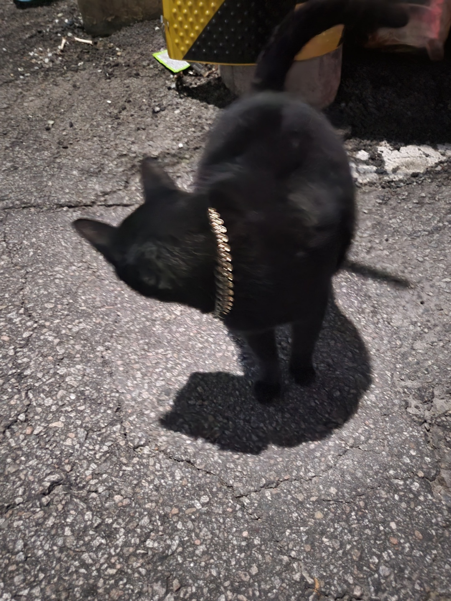

<h1>Hi! I'm a expandable Developer, Giana 🍀</h1>

  💰 Plus, Junior Backend Developer interested in fintech and blockchain.
    
  👩‍🦯 Usability for all user, focus on end-user not only for technology
    
  🗣 Communicate effectively with co-worker, estabilsh sustainable dev. environment with automated platform 

 Majoring Software Engineering in South Korea 
Contact. <strong>giananews@gmail.com</strong>📟

### Tech. stack
- django
- java
  - spring
  - JVM
  - gradle
- node.js
- soldity
- smart contract

### History
- [[Articles]] 📰
- [[Technology]] 🖥️
- [[Project]] 🤼
- [[your-first-note]]

