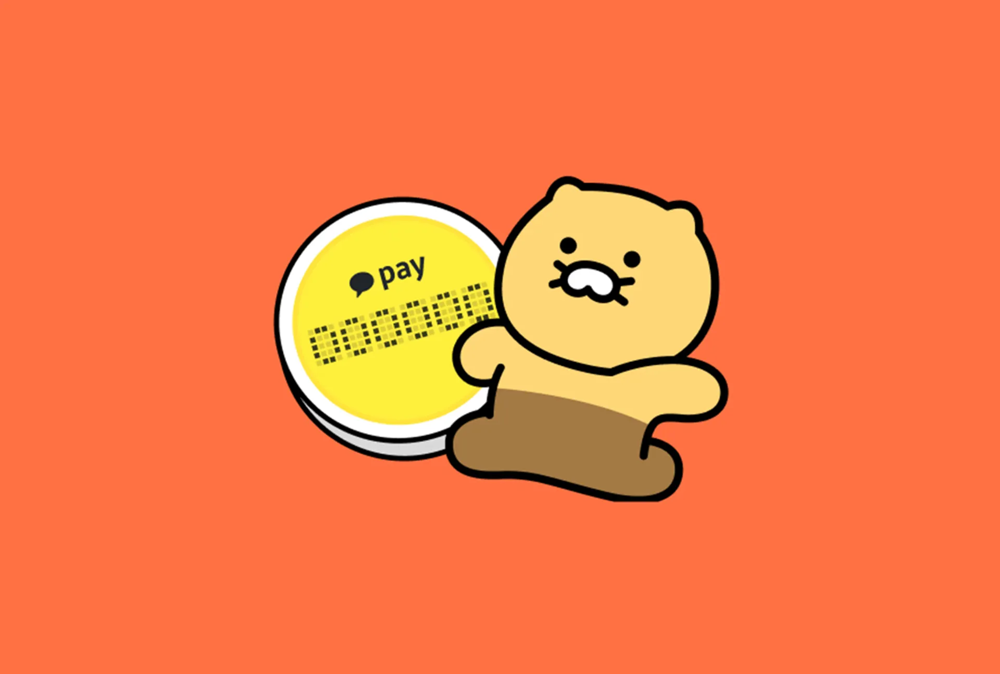

<h1>Hi! I'm a expandable Developer, Giana 🍀</h1>
<div  width="1500em" height="200em" style="background: #E8F3D6">
<p style="padding: 2em 1em; border-radius: 4px;">
  💰 Plus, <span style="font-weight: bold">Junior Backend Developer</span> interested in fintech and blockchain.
  <br><br>
  👩‍🦯 Usability for all user, focus on end-user not only for technology
  <br><br>
  🗣 Communicate effectively with co-worker, estabilsh sustainable dev. environment with automated platform 
</p>
</div>

<div style="padding:1em 1em; display:flex; justify-content:flex-start;">

<div style="padding:1em 0em;">
<span style="font-size: medium; padding: 0em 1em;">Contact 📟. <br><strong style="font-size: large;">giananews@gmail.com</strong></span>
<br>
<span style="font-size: medium; padding: 0em 1em;">Github 🫙.<br> <strong style="font-size: large;">
<a href="https://github.com/califonia-ahri/">Github Link</a>
</strong></span>
</div>
</div>

<hr>

### Tech. stack
BackEnd
- ```django```
- ```java```
  - ```spring```
  - ```JVM```
  - ```gradle```
- ```node.js```
BlockChian
- ```soldity```
- ```smart contract```

<hr>

### History
- [[Articles]] 📰
- [[Technology]] 🖥️
- [[Project]] 🤼
- [[your-first-note]]

<style>
  .wrapper {
    max-width: 46em;
  }
</style>
